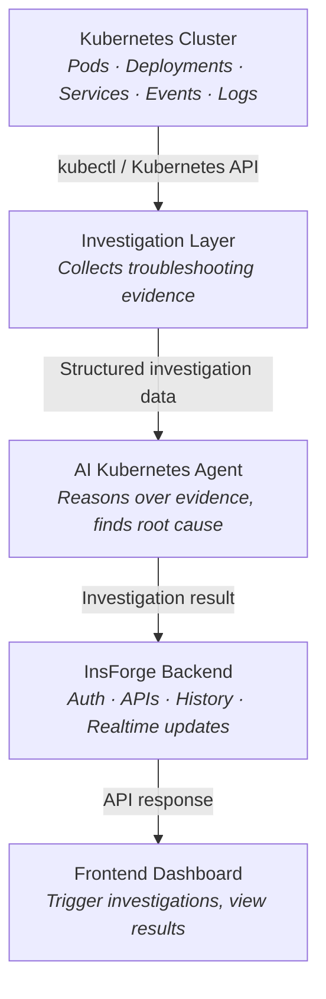
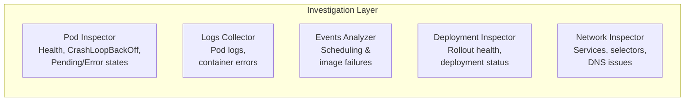
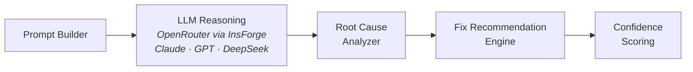
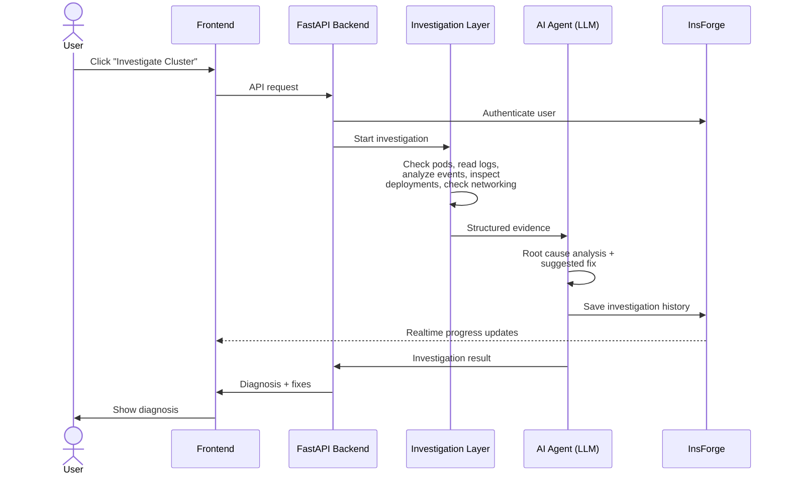
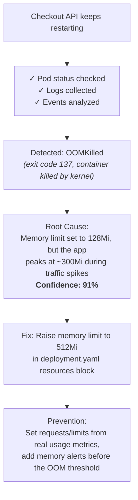

# AI Kubernetes Troubleshooting Agent

An AI-powered platform that investigates Kubernetes failures, analyzes logs, events, and cluster state, identifies root causes, and suggests fixes with full investigation history and a public web dashboard.

## What It Does

- **Investigates** Kubernetes failures automatically
- **Analyzes** logs, events, and cluster state
- **Identifies** root causes with confidence scoring
- **Suggests** fixes (kubectl commands and YAML updates)
- **Stores** investigation history
- **Deploys** publicly as a real application

## High-Level Architecture

The system is made of five layers. Evidence flows up from the cluster, gets analyzed by the AI agent, and results are stored and displayed to the user.



## Layer Breakdown

### 1. Investigation Layer

Connects to the cluster and gathers debugging evidence through five inspectors:



### 2. AI Kubernetes Agent

Turns raw evidence into a diagnosis:



| Component | Responsibility |
| --- | --- |
| Prompt Builder | Converts investigation data into an LLM prompt |
| LLM Reasoning | Understands failures via OpenRouter (Claude, GPT, DeepSeek) |
| Root Cause Analyzer | Correlates logs + events + deployment state to detect the primary issue |
| Fix Recommendation Engine | Suggests kubectl fixes and YAML updates |
| Confidence Scoring | Attaches a confidence % to each diagnosis |

### 3. InsForge Backend

| Component | Responsibility |
| --- | --- |
| Authentication | User login |
| API Layer | Trigger investigations, return AI analysis |
| Investigation History | Store past incidents and root cause reports |
| Realtime Updates | Live progress (✓ Checking pods → ✓ Reading logs → ✓ Analyzing events → ✓ Finding root cause) |

### 4. Frontend Dashboard

Lets users trigger investigations, watch live progress, and view the diagnosis, suggested fixes, and history.

```text
┌──────────────────────────────────────────┐
│ Incident: Orders API returning 503       │
│ Status: Investigating...                 │
│                                          │
│ ✓ Pods Checked                           │
│ ✓ Events Analyzed                        │
│ ✓ Services Inspected                     │
│                                          │
│ Root Cause: Service selector mismatch    │
│ Suggested Fix: Align service selector    │
│ with deployment pod labels               │
└──────────────────────────────────────────┘
```

### 5. Deployment

The frontend and backend are deployed via **InsForge**, which generates a public URL.

## End-to-End Workflow



## Example Investigation

**Issue:** Checkout API keeps restarting under load



## Supported Kubernetes Problems

| Category | Problems |
| --- | --- |
| **Pod failures** | CrashLoopBackOff · ImagePullBackOff · OOMKilled · Pending Pods |
| **Resources** | Resource exhaustion |
| **Deployments** | Rollout failures |
| **Networking** | Service selector mismatch · DNS resolution problems · General networking issues |
| **Health checks** | Readiness/Liveness probe failures |

## Tech Stack

- **Backend:** FastAPI, Python 3.12, Uvicorn, Pydantic, Loguru, HTTPX
- **Frontend:** Next.js 15, TypeScript, Tailwind CSS, Axios, React Query
- **AI:** OpenRouter API (Claude, GPT, DeepSeek) via InsForge
- **Platform:** InsForge (auth, database, realtime, deployment)
- **Cluster access:** kubectl / Kubernetes API
- **Infrastructure:** Docker, Docker Compose

## Project Structure

```text
k8s-ai-agent/
├── backend/            # FastAPI orchestration service
│   └── app/
│       ├── api/        # HTTP routes (health, investigations)
│       ├── core/       # Configuration and settings
│       ├── kubernetes/ # Cluster inspectors (pods, logs, events, ...)
│       ├── ai/         # Prompt building and LLM reasoning
│       ├── services/   # Investigation orchestration
│       └── models/     # Pydantic schemas
├── frontend/           # Next.js dashboard
│   └── src/
│       ├── app/        # Pages and layout
│       ├── components/ # UI components
│       ├── services/   # API client
│       ├── hooks/      # React Query hooks
│       └── types/      # TypeScript interfaces
├── docs/               # Additional documentation
└── docker-compose.yml
```

## Getting Started

### Prerequisites

- Docker and Docker Compose (for the containerized setup), or
- Python 3.12+ and Node.js 20+ (for local development)

### Run with Docker (recommended)

```bash
docker compose up --build
```

- Frontend: <http://localhost:3000>
- Backend health check: <http://localhost:8000/health>

### Run locally without Docker

Backend:

```bash
cd backend
python3 -m venv .venv && source .venv/bin/activate
pip install -r requirements.txt
uvicorn app.main:app --reload --port 8000
```

Frontend (in a second terminal):

```bash
cd frontend
npm install
cp .env.example .env.local   # points the UI at http://localhost:8000
npm run dev
```

### Configuration

Copy `backend/.env.example` to `backend/.env` and fill in the values when you are ready to enable AI analysis and cluster access:

```env
OPENROUTER_API_KEY=   # LLM access via OpenRouter
OPENROUTER_MODEL=     # e.g. a Claude, GPT, or DeepSeek model id
KUBECONFIG_PATH=      # path to the kubeconfig of the target cluster
```

The `.env` file is optional at this stage — the app runs with only the health endpoint and placeholder logic.

See [backend/README.md](backend/README.md) and [frontend/README.md](frontend/README.md) for service-specific details.
